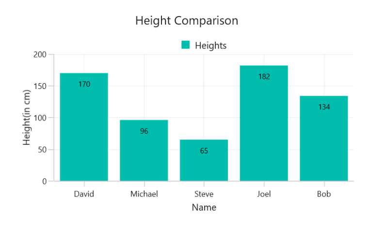

# GettingStartedCartesianChartWinUI
This is demo application of WinUI SfCartesianChart control. The minimal set of required properties have been configured in this project to get started with SfCartesianChart in WinUI.

## <a name="description"></a>Description ##

## Initialize Chart
Add reference to [Syncfusion.Chart.WinUI](https://www.nuget.org/packages/Syncfusion.Chart.WinUI/) NuGet and import the control namespace `Syncfusion.UI.Xaml.Charts`  in XAML or C# to initialize the control.

###### Xaml
```xaml

<Window
    .....
    xmlns:model="using:CartesianChartDesktop"
    xmlns:chart="using:Syncfusion.UI.Xaml.Charts">  
    
    <chart:SfCartesianChart />            
    
</Window>
 ```
###### C#
```C#

using Syncfusion.UI.Xaml.Charts;

namespace CartesianChartDesktop
{
    public sealed partial class MainPage : Window
    {
        public MainPage()
        {
            InitializeComponent();
            
            SfCartesianChart chart = new SfCartesianChart();      
            this.Content = chart;
        }
    }   
}
```

## Initialize Chart Axis

[ChartAxis](https://help.syncfusion.com/cr/winui/Syncfusion.UI.Xaml.Charts.ChartAxis.html) is used to locate the data points inside the chart area. The [XAxes]() and [YAxes]() properties of the chart is used to initialize the axis for the chart.

###### Xaml
```xaml
<chart:SfCartesianChart> 

      <chart:SfCartesianChart.XAxes> 
           <chart:CategoryAxis/> 
      </chart:SfCartesianChart.XAxes> 

      <chart:SfCartesianChart.YAxes> 
           <chart:NumericalAxis/> 
      </chart:SfCartesianChart.YAxes>

</chart:SfCartesianChart>
```
###### C#
```C#

SfCartesianChart chart = new SfCartesianChart();

CategoryAxis xAxis = new CategoryAxis();
chart.XAxes.Add(xAxis);
NumericalAxis yAxis = new NumericalAxis();
chart.YAxes.Add(yAxis);
```

## Initialize View Model

Now, let us define a simple data model that represents a data point in chart.

###### C#
```C#

public class Person   
{   
    public string Name { get; set; }

    public double Height { get; set; }
}
```

Next, create a view model class and initialize a list of `Person` objects as follows.

###### C#
```C#
public class ViewModel  
{
      public ObservableCollection<Person> Data { get; set; }      

      public ViewModel()       
      {
            Data = new ObservableCollection<Person>()
            {
                new Person { Name = "David", Height = 170 },
                new Person { Name = "Michael", Height = 96 },
                new Person { Name = "Steve", Height = 65 },
                new Person { Name = "Joel", Height = 182 },
                new Person { Name = "Bob", Height = 134 }
            }; 
       }
 }
 ```

Set the `ViewModel` instance as the `DataContext` of your window; this is done to bind properties of `ViewModel` to  the chart.
 
N> Add namespace of `ViewModel` class to your XAML Page if you prefer to set `DataContext` in XAML.

###### Xaml
```xaml
<Window
    .....
    xmlns:model="using:CartesianChartDesktop"
    xmlns:chart="using:Syncfusion.UI.Xaml.Charts">

    <chart:SfCartesianChart>

        <chart:SfCartesianChart.DataContext>
            <model:ViewModel/>
        </chart:SfCartesianChart.DataContext>

    </chart:SfCartesianChart>
</Window>
```
###### C#
```C#
ViewModel viewModel = new ViewModel();

SfCartesianChart chart = new SfCartesianChart();
chart.DataContext = viewModel;
```

## Populate Chart with Data

As we are going to visualize the comparison of heights in the data model, add [ColumnSeries](https://help.syncfusion.com/cr/winui/Syncfusion.UI.Xaml.Charts.ColumnSeries.html) to [Series](https://help.syncfusion.com/cr/winui/Syncfusion.UI.Xaml.Charts.SfCartesianChart.html#Syncfusion_UI_Xaml_Charts_SfCartesianChart_Series) property of chart, and then bind the `Data` property of the above `ViewModel` to the `ColumnSeries.ItemsSource` as follows.

N> You need to set [XBindingPath](https://help.syncfusion.com/cr/winui/Syncfusion.UI.Xaml.Charts.ChartSeriesBase.html#Syncfusion_UI_Xaml_Charts_ChartSeriesBase_XBindingPath) and [YBindingPath](https://help.syncfusion.com/cr/winui/Syncfusion.UI.Xaml.Charts.XyDataSeries.html#Syncfusion_UI_Xaml_Charts_XyDataSeries_YBindingPath) properties, so that chart would fetch values from the respective properties in the data model to plot the series.

###### Xaml
```xaml
<chart:SfCartesianChart>

    <chart:SfCartesianChart.XAxes>
        <chart:CategoryAxis Header="Name"/>
    </chart:SfCartesianChart.XAxes>

    <chart:SfCartesianChart.YAxes>
        <chart:NumericalAxis Header="Height(in cm)"/>
    </chart:SfCartesianChart.YAxes>    

    <chart:ColumnSeries  ItemsSource="{Binding Data}"
                              XBindingPath="Name"
                              YBindingPath="Height">
    </chart:ColumnSeries>

 </chart:SfCartesianChart> 
```

###### C#
```C#
SfCartesianChart chart = new SfCartesianChart();

//Adding horizontal axis to the chart 
CategoryAxis xAxis = new CategoryAxis();
xAxis.Header = "Name";
chart.XAxes.Add(xAxis);

//Adding vertical axis to the chart 
NumericalAxis yAxis = new NumericalAxis();
yAxis.Header = "Height(in cm)";
chart.YAxes.Add(yAxis);

//Initialize the column series for chart
ColumnSeries series = new ColumnSeries();
series.ItemsSource = (new ViewModel()).Data;
series.XBindingPath = "Name";            
series.YBindingPath = "Height";         
            
//Adding Series to the Chart Series Collection
chart.Series.Add(series);
```
## Add Title

The title of the chart provide quick information to the user about the data being plotted in the chart. The `Header` property is used to set title for the chart as follows.

###### Xaml
```xaml
   <chart:SfCartesianChart Header="Height Comparison"> 
   </chart:SfCartesianChart> 
```
###### C#
```C#
SfCartesianChart chart = new SfCartesianChart();
chart.Header = "Height Comparison";
```

## Enable Data Labels

The [ShowDataLabels](https://help.syncfusion.com/cr/winui/Syncfusion.UI.Xaml.Charts.DataMarkerSeries.html#Syncfusion_UI_Xaml_Charts_DataMarkerSeries_ShowDataLabels) property of series can be used to enable the data labels to improve the readability of the chart. The label visibility is set to `False` by default.

###### Xaml
```xaml
<chart:SfCartesianChart>
	...
    <chart:ColumnSeries ShowDataLabels="True">
    </chart:ColumnSeries>  
	...
</chart:SfCartesianChart>
```
###### C#
```C#
SfCartesianChart chart = new SfCartesianChart();
. . .
ColumnSeries series = new ColumnSeries();
series.ShowDataLabels = true;
chart.Series.Add(series); 
```

## Enable Legend

The legend provides information about the data point displayed in the chart. The [Legend](https://help.syncfusion.com/cr/winui/Syncfusion.UI.Xaml.Charts.ChartBase.html#Syncfusion_UI_Xaml_Charts_ChartBase_Legend) property of the chart was used to enable it.

###### Xaml
```xaml
<chart:SfCartesianChart>
    . . .
    <chart:SfCartesianChart.Legend>
        <chart:ChartLegend/>
    </chart:SfCartesianChart.Legend>
    . . .
</chart:SfCartesianChart>
```
###### C#
```C#
SfCartesianChart chart = new SfCartesianChart();
chart.Legend = new ChartLegend ();
```

Additionally, you need to set label for each series using the [Label](https://help.syncfusion.com/cr/winui/Syncfusion.UI.Xaml.Charts.ChartSeriesBase.html#Syncfusion_UI_Xaml_Charts_ChartSeriesBase_Label) property of ChartSeries, which will be displayed in corresponding legend.

###### Xaml
```xaml
<chart:SfCartesianChart>
. . .
    <chart:ColumnSeries Label="Heights"
                        ItemsSource="{Binding Data}"
                        XBindingPath="Name" 
                        YBindingPath="Height">
    </chart:ColumnSeries>
</chart:SfCartesianChart>
```
###### C#
```C#
SfCartesianChart chart = new SfCartesianChart();

ColumnSeries series = new ColumnSeries (); 
series.ItemsSource = (new ViewModel()).Data;
series.XBindingPath = "Name"; 
series.YBindingPath = "Height"; 
series.Label = "Heights";
chart.Series.Add(series);
```
## Enable Tooltip

Tooltips are used to show information about the segment, when hovers on the segment. Enable tooltip by setting series [ShowTooltip](https://help.syncfusion.com/cr/winui/Syncfusion.UI.Xaml.Charts.ChartSeriesBase.html#Syncfusion_UI_Xaml_Charts_ChartSeriesBase_ShowTooltip) property to true.

###### Xaml
```xaml
<chart:SfCartesianChart>
	...
   <chart:ColumnSeries ShowTooltip="True" ItemsSource="{Binding Data}" 
            XBindingPath="Name" YBindingPath="Height"/>
	...
</chart:SfCartesianChart> 
```
###### C#
```C#
SfCartesianChart chart = new SfCartesianChart();

ColumnSeries series = new ColumnSeries();
series.ItemsSource = (new ViewModel()).Data;
series.XBindingPath = "Name";          
series.YBindingPath = "Height";
series.ShowTooltip = true;
chart.Series.Add(series);
```
The following code example gives you the complete code of above configurations.

###### Xaml
```xaml
<Window
    .....
    xmlns:model="using:CartesianChartDesktop"
    xmlns:chart="using:Syncfusion.UI.Xaml.Charts">
    
    <chart:SfCartesianChart Header="Height Comparison" Height="500" Width="800">

        <!--Setting DataContext-->
        <chart:SfCartesianChart.DataContext>
            <model:ViewModel/>
        </chart:SfCartesianChart.DataContext>
        
        <!--Initialize the horizontal axis to the SfCartesianChart-->
        <chart:SfCartesianChart.XAxes>
            <chart:CategoryAxis Header="Names"/>
        </chart:SfCartesianChart.XAxes>

       <!--Initialize the vertical axis to the SfCartesianChart-->
        <chart:SfCartesianChart.YAxes>
            <chart:NumericalAxis Header="Height(in cm)"/>
        </chart:SfCartesianChart.YAxes>

        <!--Initialize the legend to the SfCartesianChart-->
        <chart:SfCartesianChart.Legend>
            <chart:ChartLegend/>
        </chart:SfCartesianChart.Legend>

        <!--Initialize the series to the SfCartesianChart-->
        <chart:ColumnSeries Label="Heights" ShowTooltip="True"
                                ShowDataLabels="True"
                                ItemsSource="{Binding Data}"
                                XBindingPath="Name" 
                                YBindingPath="Height">
            <chart:ColumnSeries.DataLabelSettings>
                <chart:CartesianDataLabelSettings Position="Inner"/>
            </chart:ColumnSeries.DataLabelSettings>
        </chart:ColumnSeries>
        
    </chart:SfCartesianChart>
</Window>
``` 
###### C#
```C#
using Syncfusion.UI.Xaml.Charts;

namespace CartesianChartDesktop
{
    public sealed partial class MainPage : Window
    {
        public MainPage()
        {
            InitializeComponent();
            
            SfCartesianChart chart = new SfCartesianChart() { Header = "Height Comparison", 
            Height="500", Width="800" };

            //Adding horizontal axis to the Cartesian chart 
            CategoryAxis xAxis = new CategoryAxis();
            xAxis.Header = "Name";
            xAxis.FontSize = 14;
            chart.XAxes.Add(xAxis);

            //Adding vertical axis to the Cartesian chart 
            NumericalAxis yAxis = new NumericalAxis();
            yAxis.Header = "Height(in cm)";
            yAxis.FontSize = 14;
            chart.YAxes.Add(yAxis);

            //Adding Legends for the Cartesian chart
            ChartLegend legend = new ChartLegend();
            chart.Legend = legend;

            //Initializing column series
            ColumnSeries series = new ColumnSeries();
            series.ItemsSource = (new ViewModel()).Data;
            series.XBindingPath = "Name";            
            series.YBindingPath = "Height";
            series.ShowTooltip = true;
            series.Label = "Heights"; 
            series.ShowDataLabels = true;
            series.DataLabelSettings = new CartesianDataLabelSettings()
            {
                Position = DataLabelPosition.Inner,
            };

            //Adding Series to the Cartesian chart Series Collection
            chart.Series.Add(series);
            this.Content = chart;    
        }
    }   
}
```

## <a name="output"></a>Output ##



For more details please refer this ug [CartesianCharts](https://help.syncfusion.com/winui/cartesian-charts/getting-started/?utm_medium=listing&utm_source=github-examples).