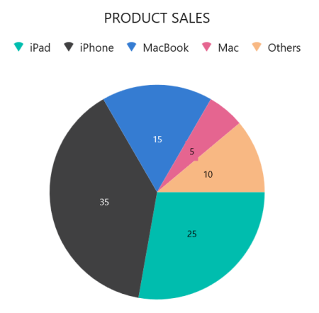

# GettingStartedCircularChartWinUI
This is demo application of WinUI SfCircularChart control. The minimal set of required properties have been configured in this project to get started with SfCircularChart in WinUI.

## <a name="description"></a>Description ##

## Initialize Chart
Add reference to [Syncfusion.Chart.WinUI](https://www.nuget.org/packages/Syncfusion.Chart.WinUI/) NuGet and import the control namespace `Syncfusion.UI.Xaml.Charts`  in XAML or C# to initialize the control.

###### Xaml
```xaml

<Window
    .....
    xmlns:model="using:CircularChartDesktop"
    xmlns:chart="using:Syncfusion.UI.Xaml.Charts">  

    <chart:SfCircularChart />            

</Window>
 ```
###### C#
```C#

using Syncfusion.UI.Xaml.Charts;

namespace CircularChartDesktop
{
    public sealed partial class MainPage : Window
    {
        public MainPage()
        {
            InitializeComponent();
            
            SfCircularChart chart = new SfCircularChart();
            . . .
            this.Content = chart;
        }
    }   
}
```

## Initialize View Model

Now, let us define a simple data model that represents a data point in chart.

###### C#
```C#

public class Sales
{
    public string Product { get; set; }

    public double SalesRate { get; set; }
}
```

Next, create a view model class and initialize a list of `Sales` objects as follows.

###### C#
```C#
public class ChartViewModel
{
    public ObservableCollection<Sales> Data { get; set; }

    public ChartViewModel()
    {
        Data = new ObservableCollection<Sales>()
        {
            new Sales(){Product = "iPad", SalesRate = 25},
            new Sales(){Product = "iPhone", SalesRate = 35},
            new Sales(){Product = "MacBook", SalesRate = 15},
            new Sales(){Product = "Mac", SalesRate = 5},
            new Sales(){Product = "Others", SalesRate = 10},
        };
    }
}
 ```

Create a `ChartViewModel` instance and set it as the chart's `DataContext`. This enables property binding from `ChartViewModel` class.
 
N> Add namespace of `ChartViewModel` class to your XAML Page if you prefer to set `DataContext` in XAML.

###### Xaml
```xaml
<Window
    .....
    xmlns:model="using:CircularChartDesktop"
    xmlns:chart="using:Syncfusion.UI.Xaml.Charts">

    <chart:SfCircularChart>

        <chart:SfCircularChart.DataContext>
            <model:ChartViewModel/>
        </chart:SfCircularChart.DataContext>

    </chart:SfCircularChart>
</Window>
```
###### C#
```C#
ChartViewModel viewModel = new ChartViewModel();

SfCircularChart chart = new SfCircularChart();
chart.DataContext = viewModel;
```

## Populate Chart With Data

Adding [PieSeries](https://help.syncfusion.com/cr/winui/Syncfusion.UI.Xaml.Charts.PieSeries.html) to the chart [Series](https://help.syncfusion.com/cr/winui/Syncfusion.UI.Xaml.Charts.SfCircularChart.html#Syncfusion_UI_Xaml_Charts_SfCircularChart_Series) collection and binding `Data` to the series [ItemsSource](https://help.syncfusion.com/cr/winui/Syncfusion.UI.Xaml.Charts.ChartSeriesBase.html#Syncfusion_UI_Xaml_Charts_ChartSeriesBase_ItemsSource) property from its `DataContext` for creating our own Product – Sales Pie chart.

N> To plot the series, the [XBindingPath](https://help.syncfusion.com/cr/winui/Syncfusion.UI.Xaml.Charts.ChartSeriesBase.html#Syncfusion_UI_Xaml_Charts_ChartSeriesBase_XBindingPath) and [YBindingPath](https://help.syncfusion.com/cr/winui/Syncfusion.UI.Xaml.Charts.XyDataSeries.html#Syncfusion_UI_Xaml_Charts_XyDataSeries_YBindingPath) properties must be configured so that the chart may get values from the respective properties in the data model.

###### Xaml
```xaml
<chart:SfCircularChart>
. . .
    <chart:SfCircularChart.Series>
        <chart:PieSeries ItemsSource="{Binding Data}" 
                         XBindingPath="Product" 
                         YBindingPath="SalesRate"/>
    </chart:SfCircularChart.Series>

</chart:SfCircularChart> 
```

###### C#
```C#
SfCircularChart chart = new SfCircularChart();

ChartViewModel viewModel = new ChartViewModel();
chart.DataContext = viewModel;

PieSeries series = new PieSeries();
series.XBindingPath = "Product";
series.YBindingPath = "SalesRate";

series.SetBinding(
    PieSeries.ItemsSourceProperty, 
    new Binding() 
    { Path = new PropertyPath("Data") });

chart.Series.Add(series);
```
## Add Title

The title of the chart provide quick information to the user about the data being plotted in the chart. The `Header` property is used to set title for the chart as follows.

###### Xaml
```xaml
   <chart:SfCircularChart Header="PRODUCT SALES">
    . . .
   </chart:SfCircularChart> 
```
###### C#
```C#
SfCircularChart chart = new SfCircularChart();
. . .
chart.Header = "PRODUCT SALES";
```

## Enable Data Labels

The [ShowDataLabels](https://help.syncfusion.com/cr/winui/Syncfusion.UI.Xaml.Charts.DataMarkerSeries.html#Syncfusion_UI_Xaml_Charts_DataMarkerSeries_ShowDataLabels) property of series can be used to enable the data labels to improve the readability of the chart. The label visibility is set to `False` by default.

###### Xaml
```xaml
<chart:SfCircularChart>
. . .
    <chart:PieSeries ShowDataLabels="True"
                     ItemsSource="{Binding Data}" 
                     XBindingPath="Product" 
                     YBindingPath="SalesRate"/>
</chart:SfCircularChart>
```
###### C#
```C#
SfCircularChart chart = new SfCircularChart();
. . .
PieSeries series = new PieSeries();
series.ShowDataLabels = true;

chart.Series.Add(series); 
```

## Enable Legend

The legend provides information about the data point displayed in the chart. The [Legend](https://help.syncfusion.com/cr/winui/Syncfusion.UI.Xaml.Charts.ChartBase.html#Syncfusion_UI_Xaml_Charts_ChartBase_Legend) property of the chart was used to enable it.

###### Xaml
```xaml
<chart:SfCircularChart>
    . . .
    <chart:SfCircularChart.Legend>
        <chart:ChartLegend/>
    </chart:SfCircularChart.Legend>

</chart:SfCircularChart>
```
###### C#
```C#
SfCircularChart chart = new SfCircularChart();
. . .
chart.Legend = new ChartLegend();
```

## Enable tooltip

Tooltips are used to show information about the segment, when hovers on the segment. Enable tooltip by setting series [ShowTooltip](https://help.syncfusion.com/cr/winui/Syncfusion.UI.Xaml.Charts.ChartSeriesBase.html#Syncfusion_UI_Xaml_Charts_ChartSeriesBase_ShowTooltip) property to true.

###### Xaml
```xaml
<chart:SfCircularChart>
. . .
    <chart:PieSeries ShowTooltip="True"/>
</chart:SfCircularChart> 
```
###### C#
```C#
SfCircularChart chart = new SfCircularChart();
. . .
PieSeries series = new PieSeries();
series.ShowTooltip = true;

chart.Series.Add(series);
```

The following code example gives you the complete code of above configurations.

###### Xaml
```xaml
<Window
    .....
    xmlns:model="using:CircularChartDesktop"
    xmlns:chart="using:Syncfusion.UI.Xaml.Charts">
    
    <chart:SfCircularChart Header="PRODUCT SALES">

            <chart:SfCircularChart.DataContext>
                 <model:ChartViewModel/>
            </chart:SfCircularChart.DataContext>

            <chart:SfCircularChart.Legend>
                  <chart:ChartLegend/>
             </chart:SfCircularChart.Legend>

             <chart:SfCircularChart.Series>
                    <chart:PieSeries ItemsSource="{Binding Data}" 
                         XBindingPath="Product" ShowTooltip="True"
                         YBindingPath="SalesRate" ShowDataLabels="True"
                         Palette="BlueChrome">
                    </chart:PieSeries>
             </chart:SfCircularChart.Series>
             
    </chart:SfCircularChart>
</Window>
``` 
###### C#
```C#
using Syncfusion.UI.Xaml.Charts;

namespace CircularChartDesktop
{
    public sealed partial class MainPage : Window
    {
        public MainPage()
        {
            InitializeComponent();
            
            SfCircularChart chart = new SfCircularChart();

            chart.Header = "PRODUCT SALES";
            chart.Legend = new ChartLegend();
            ChartViewModel viewModel = new ChartViewModel();
            chart.DataContext = viewModel;

            PieSeries series = new PieSeries();
            series.XBindingPath = "Product";
            series.YBindingPath = "SalesRate";
            series.ShowTooltip = true;
            series.ShowDataLabels = true;
            series.Palette = ChartColorPalette.BlueChrome;

            series.SetBinding(
                PieSeries.ItemsSourceProperty, 
                new Binding() 
                { Path = new PropertyPath("Data") });

            chart.Series.Add(series);
            this.Content = chart;
        }
    }   
}
```

## <a name="output"></a>Output ##



For more details please refer this ug [CircularCharts](https://help.syncfusion.com/winui/circular-charts/getting-started/?utm_medium=listing&utm_source=github-examples).