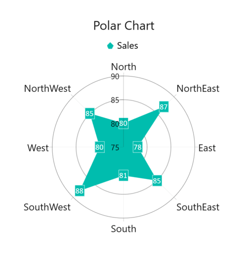

# GettingStartedPolarChartWinUI
This is demo application of WinUI SfPolarChart control. The minimal set of required properties have been configured in this project to get started with SfPolarChart in WinUI.

## <a name="description"></a>Description ##

## Initialize Chart
Add reference to [Syncfusion.Chart.WinUI](https://www.nuget.org/packages/Syncfusion.Chart.WinUI/) NuGet and import the control namespace `Syncfusion.UI.Xaml.Charts`  in XAML or C# to initialize the control.

###### Xaml
```xaml

<Window
    ...
    xmlns:model="using:PolarChartGettingStartedDesktop"
    xmlns:chart="using:Syncfusion.UI.Xaml.Charts">  

    <chart:SfPolarChart />            

</Window>
 ```
###### C#
```C#

using Syncfusion.UI.Xaml.Charts;

namespace PolarChartGettingStartedDesktop
{
    public sealed partial class MainPage : Window
    {
        public MainPage()
        {
            InitializeComponent();
            
            SfPolarChart chart = new SfPolarChart();      
            ...
            this.Content = chart;
        }
    }   
}
```

## Initialize View Model

Now, let us define a simple data model that represents a data point in chart.

###### C#
```C#

public class Model
{
    public string Category { get; set; }
    public double Value { get; set; }
}
```

Next, create a view model class and initialize a list of `Model` objects as follows.

###### C#
```C#
public class ChartViewModel
{
    public ObservableCollection<Model> Data { get; set; }

    public ChartViewModel()
    {
        Data = new ObservableCollection<Model>()
        {
            new Model(){ Category = "North", Value = 80 },
            new Model(){ Category = "NorthEast", Value = 87 },
            new Model(){ Category = "East", Value = 78 },
            new Model(){ Category = "SouthEast", Value = 85 },
            new Model(){ Category = "South", Value = 81 },
            new Model(){ Category = "SouthWest", Value = 88 },
            new Model(){ Category = "West", Value = 80 },
            new Model(){ Category = "NorthWest", Value = 85 },
        };
    }
}
 ```

Create a `ChartViewModel` instance and set it as the chart's `DataContext`. This enables property binding from the `ChartViewModel` class.
 
N> If you prefer to set `DataContext` in XAML, add the namespace of the `ViewModel` class to your XAML Page.

###### Xaml
```xaml
<Window
    ...
    xmlns:model="using:PolarChartGettingStartedDesktop"
    xmlns:chart="using:Syncfusion.UI.Xaml.Charts">

    <chart:SfPolarChart>

        <chart:SfPolarChart.DataContext>
            <model:ChartViewModel/>
        </chart:SfPolarChart.DataContext>

    </chart:SfPolarChart>
</Window>
```
###### C#
```C#
ChartViewModel viewModel = new ChartViewModel();

SfPolarChart chart = new SfPolarChart();
chart.DataContext = viewModel;
```
## Initialize Chart Axis

[ChartAxis](https://help.syncfusion.com/cr/winui/Syncfusion.UI.Xaml.Charts.ChartAxis.html) is used to locate the data points inside the chart area. The [PrimaryAxis](https://help.syncfusion.com/cr/winui/Syncfusion.UI.Xaml.Charts.SfPolarChart.html#Syncfusion_UI_Xaml_Charts_SfPolarChart_PrimaryAxis) and [SecondaryAxis](https://help.syncfusion.com/cr/winui/Syncfusion.UI.Xaml.Charts.SfPolarChart.html#Syncfusion_UI_Xaml_Charts_SfPolarChart_SecondaryAxis) properties of the chart is used to initialize the axis for the chart.

###### Xaml
```xaml
<chart:SfPolarChart> 

      <chart:SfPolarChart.PrimaryAxis> 
           <chart:CategoryAxis /> 
      </chart:SfPolarChart.PrimaryAxis> 

      <chart:SfPolarChart.SecondaryAxis> 
           <chart:NumericalAxis/> 
      </chart:SfPolarChart.SecondaryAxis>

</chart:SfPolarChart>
```
###### C#
```C#

SfPolarChart chart = new SfPolarChart();

CategoryAxis primaryAxis = new CategoryAxis();
chart.PrimaryAxis = primaryAxis;    

NumericalAxis secondaryAxis = new NumericalAxis();
chart.SecondaryAxis = secondaryAxis;
```

## Populate Chart With Data

Adding [PolarAreaSeries](https://help.syncfusion.com/cr/winui/Syncfusion.UI.Xaml.Charts.PolarAreaSeries.html) to the polar chart [Series](https://help.syncfusion.com/cr/winui/Syncfusion.UI.Xaml.Charts.SfPolarChart.html#Syncfusion_UI_Xaml_Charts_SfPolarChart_Series) collection and binding `Data` to the series [ItemsSource](https://help.syncfusion.com/cr/winui/Syncfusion.UI.Xaml.Charts.ChartSeriesBase.html#Syncfusion_UI_Xaml_Charts_ChartSeriesBase_ItemsSource) property from its `DataContext` for creating polar chart.

N> To plot the series, the [XBindingPath]((https://help.syncfusion.com/cr/winui/Syncfusion.UI.Xaml.Charts.ChartSeriesBase.html#Syncfusion_UI_Xaml_Charts_ChartSeriesBase_XBindingPath) and [YBindingPath](https://help.syncfusion.com/cr/winui/Syncfusion.UI.Xaml.Charts.XyDataSeries.html#Syncfusion_UI_Xaml_Charts_XyDataSeries_YBindingPath) properties must be configured so that the chart may get values from the respective properties in the data model.

###### Xaml
```xaml
<chart:SfPolarChart>

    <chart:SfPolarChart.PrimaryAxis> 
        <chart:CategoryAxis /> 
    </chart:SfPolarChart.PrimaryAxis> 

    <chart:SfPolarChart.SecondaryAxis> 
        <chart:NumericalAxis/> 
    </chart:SfPolarChart.SecondaryAxis>

    <chart:SfPolarChart.Series>
        <chart:PolarAreaSeries ItemsSource="{Binding Data}" 
                         XBindingPath="Category" 
                         YBindingPath="Value"/>
    </chart:SfPolarChart.Series>
    ...
</chart:SfPolarChart> 
```

###### C#
```C#
SfPolarChart chart = new SfPolarChart();

ChartViewModel viewModel = new ChartViewModel();
chart.DataContext = viewModel;

CategoryAxis primaryAxis = new CategoryAxis();
chart.PrimaryAxis = primaryAxis;    

NumericalAxis secondaryAxis = new NumericalAxis();
chart.SecondaryAxis = secondaryAxis;

PolarAreaSeries series = new PolarAreaSeries();
series.XBindingPath = "Category";
series.YBindingPath = "Value";

series.SetBinding(
    ChartSeriesBase.ItemsSourceProperty, 
    new Binding() 
    { Path = new PropertyPath("Data") });

chart.Series.Add(series);
. . .
```
## Add Title

The title of the chart provide quick information to the user about the data being plotted in the chart. The `Header` property is used to set title for the chart as follows.

###### Xaml
```xaml
<chart:SfPolarChart Header="Polar Chart"> 
...
</chart:SfPolarChart>
```
###### C#
```C#
SfPolarChart chart = new SfPolarChart();
chart.Header = "Polar Chart";
...
```

## Enable Data Labels

The [ShowDataLabels](https://help.syncfusion.com/cr/winui/Syncfusion.UI.Xaml.Charts.DataMarkerSeries.html#Syncfusion_UI_Xaml_Charts_DataMarkerSeries_ShowDataLabels) property of series can be used to enable the data labels to improve the readability of the chart. The label visibility is set to `False` by default.

###### Xaml
```xaml
<chart:SfPolarChart>
    ...
    <chart:PolarAreaSeries ShowDataLabels="True"
                        ItemsSource="{Binding Data}" 
                        XBindingPath="Category" 
                        YBindingPath="Value">
    </chart:PolarAreaSeries>
</chart:SfPolarChart>
```
###### C#
```C#
SfPolarChart chart = new SfPolarChart();
PolarAreaSeries series = new PolarAreaSeries();
series.ShowDataLabels = true;
chart.Series.Add(series);
...
```

## Enable Legend

The legend provides information about the data point displayed in the chart. The [Legend](https://help.syncfusion.com/cr/winui/Syncfusion.UI.Xaml.Charts.ChartBase.html#Syncfusion_UI_Xaml_Charts_ChartBase_Legend) property of the chart was used to enable it.

###### Xaml
```xaml
<chart:SfPolarChart>
    ...
    <chart:SfPolarChart.Legend>
        <chart:ChartLegend/>
    </chart:SfPolarChart.Legend>
    ...
</chart:SfPolarChart>
```
###### C#
```C#
SfPolarChart chart = new SfPolarChart();
chart.Legend = new ChartLegend ();
```

N> Additionally, set label for each series using the [Label](https://help.syncfusion.com/cr/winui/Syncfusion.UI.Xaml.Charts.ChartSeriesBase.html#Syncfusion_UI_Xaml_Charts_ChartSeriesBase_Label) property of chart series, which will be displayed in corresponding legend.

###### Xaml
```xaml
<chart:SfPolarChart>
    . . .
    <chart:PolarAreaSeries  ItemsSource="{Binding Data}" 
                        XBindingPath="Product" 
                        YBindingPath="SalesRate"
                        Label="Sales"/>
    ...
</chart:SfPolarChart>
```
###### C#
```C#
SfPolarChart chart = new SfPolarChart();
...
PolarAreaSeries series = new PolarAreaSeries();
series.XBindingPath = "Product";
series.YBindingPath = "SalesRate";
series.Label = "Sales";
chart.Series.Add(series);
```

The following code example gives you the complete code of above configurations.

###### Xaml
```xaml
<Window
    ...
    xmlns:model="using:PolarChartGettingStartedDesktop"
    xmlns:chart="using:Syncfusion.UI.Xaml.Charts">
    
    <chart:SfPolarChart Header="Polar Chart">

        <chart:SfPolarChart.DataContext>
            <model:ChartViewModel/>
        </chart:SfPolarChart.DataContext>

        <chart:SfPolarChart.PrimaryAxis> 
           <chart:CategoryAxis/> 
        </chart:SfPolarChart.PrimaryAxis> 

        <chart:SfPolarChart.SecondaryAxis> 
           <chart:NumericalAxis/> 
        </chart:SfPolarChart.SecondaryAxis>

        <chart:SfPolarChart.Legend>
            <chart:ChartLegend/>
        </chart:SfPolarChart.Legend>

        <chart:SfPolarChart.Series>
            <chart:PolarAreaSeries ItemsSource="{Binding Data}" 
                         XBindingPath="Category"
                         YBindingPath="Value"
                         Label="Sales"
                         LegendIcon="Circle"
                         ShowDataLabels ="True">
            </chart:PolarAreaSeries>
        </chart:SfPolarChart.Series>
    </chart:SfPolarChart>
</Window>
``` 
###### C#
```C#
using Syncfusion.UI.Xaml.Charts;

namespace PolarChartGettingStartedDesktop
{
    public sealed partial class MainPage : Window
    {
        public MainPage()
        {
            InitializeComponent();
            
            SfPolarChart chart = new SfPolarChart();

            chart.Header = "Polar Chart";
            chart.Legend = new ChartLegend();
            ChartViewModel viewModel = new ChartViewModel();
            chart.DataContext = viewModel;
        
            CategoryAxis primaryAxis = new CategoryAxis();
            chart.PrimaryAxis = primaryAxis;    

            NumericalAxis secondaryAxis = new NumericalAxis();
            chart.SecondaryAxis = secondaryAxis;

            PolarAreaSeries series = new PolarAreaSeries();
            series.XBindingPath = "Category";
            series.YBindingPath = "Value";
            series.Label = "Sales";
            series.ShowDataLabels = true;
            series.LegendIcon = ChartLegendIcon.Circle;

             series.SetBinding(
                ChartSeriesBase.ItemsSourceProperty, 
                new Binding() 
                { Path = new PropertyPath("Data") });

            chart.Series.Add(series);
            this.Content = chart;    
        }
    }   
}
```

## <a name="output"></a>Output ##



For more details please refer this ug [PolarChart](https://help.syncfusion.com/winui/polar-chart/getting-started/?utm_medium=listing&utm_source=github-examples).