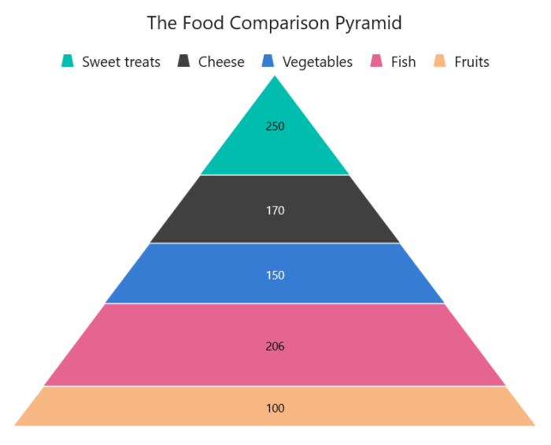

# GettingStartedPyramidChartWinUI
This is demo application of WinUI SfPyramidChart control. The minimal set of required properties have been configured in this project to get started with SfPyramidChart in WinUI.

## <a name="description"></a>Description ##

## Initialize Chart
Add reference to [Syncfusion.Chart.WinUI](https://www.nuget.org/packages/Syncfusion.Chart.WinUI/) NuGet and import the control namespace `Syncfusion.UI.Xaml.Charts`  in XAML or C# to initialize the control.

###### Xaml
```xaml

<Window
    ...
    xmlns:model="using:PyramidChartGettingStartedDesktop"
    xmlns:chart="using:Syncfusion.UI.Xaml.Charts">  

    <chart:SfPyramidChart />            

</Window>
 ```
###### C#
```C#

using Syncfusion.UI.Xaml.Charts;

namespace PyramidChartGettingStartedDesktop
{
    public sealed partial class MainPage : Window
    {
        public MainPage()
        {
            InitializeComponent();
            
            SfPyramidChart chart = new SfPyramidChart();
            . . .
            this.Content = chart;
        }
    }   
}
```

## Initialize View Model

Now, let us define a simple data model that represents a data point in chart.

###### C#
```C#

public class Model
{
    public string FoodName { get; set; }

    public double Calories { get; set; }
}
```

Next, create a view model class and initialize a list of `Model` objects as follows.

###### C#
```C#
public class ChartViewModel
{
    public ObservableCollection<Model> Data { get; set; }

    public ChartViewModel()
    {
        Data = new ObservableCollection<Model>()
        {
            new Model(){FoodName = "Sweet treats", Calories = 250},
            new Model(){FoodName = "Cheese", Calories = 402},
            new Model(){FoodName = "Vegetables", Calories = 65},
            new Model(){FoodName = "Fish", Calories = 206},
            new Model(){FoodName = "Fruits", Calories = 52},
            new Model(){FoodName = "Rice", Calories = 130},
        };
    }
}
 ```

Create a `ChartViewModel` instance and set it as the chart's `DataContext`. This enables property binding from `ChartViewModel` class.
 
N> Add namespace of `ChartViewModel` class to your XAML Page if you prefer to set `DataContext` in XAML.

###### Xaml
```xaml
<Window
    ...
    xmlns:model="using:PyramidChartGettingStartedDesktop"
    xmlns:chart="using:Syncfusion.UI.Xaml.Charts">

    <chart:SfPyramidChart>

        <chart:SfPyramidChart.DataContext>
            <model:ChartViewModel/>
        </chart:SfPyramidChart.DataContext>

    </chart:SfPyramidChart>
</Window>
```
###### C#
```C#
ChartViewModel viewModel = new ChartViewModel();

SfPyramidChart chart = new SfPyramidChart();
chart.DataContext = viewModel;
```

## Add Title

The title of the chart provide quick information to the user about the data being plotted in the chart. The `Header` property is used to set title for the chart as follows.

###### Xaml
```xaml
   <chart:SfPyramidChart Header="The Food Comparison Pyramid">
   . . .
   </chart:SfPyramidChart> 
```
###### C#
```C#
SfPyramidChart chart = new SfPyramidChart();
. . .
chart.Header = "The Food Comparison Pyramid";
```

## Enable Data Labels

The [ShowDataLabels](https://help.syncfusion.com/cr/winui/Syncfusion.UI.Xaml.Charts.SfPyramidChart.html#Syncfusion_UI_Xaml_Charts_SfPyramidChart_ShowDataLabels) property of [SfPyramidChart](https://help.syncfusion.com/cr/winui/Syncfusion.UI.Xaml.Charts.SfPyramidChart.html) can be used to enable data labels to improve the readability of the pyramid chart. The label visibility is set to `False` by default.

###### Xaml
```xaml
<chart:SfPyramidChart ShowDataLabels="True">
. . . 
</chart:SfPyramidChart>
```
###### C#
```C#
SfPyramidChart chart = new SfPyramidChart();

. . .

chart.ShowDataLabels = true; 
```

## Enable Legend

The legend provides information about the data point displayed in the chart. The [Legend](https://help.syncfusion.com/cr/winui/Syncfusion.UI.Xaml.Charts.ChartBase.html#Syncfusion_UI_Xaml_Charts_ChartBase_Legend) property of the chart was used to enable it.

###### Xaml
```xaml
<chart:SfPyramidChart>
    . . .
    <chart:SfPyramidChart.Legend>
        <chart:ChartLegend/>
    </chart:SfPyramidChart.Legend>
    ...
</chart:SfPyramidChart>
```
###### C#
```C#
SfPyramidChart chart = new SfPyramidChart();
. . .
chart.Legend = new ChartLegend();
```

## Enable Tooltip

Tooltips are used to show information about the segment, when hovers on the segment. Enable tooltip by setting pyramid chart [ShowTooltip](https://help.syncfusion.com/cr/winui/Syncfusion.UI.Xaml.Charts.SfPyramidChart.html#Syncfusion_UI_Xaml_Charts_SfPyramidChart_ShowTooltip) property as true.

###### Xaml
```xaml
<chart:SfPyramidChart ShowTooltip="True">
    . . . 
</chart:SfPyramidChart> 
```
###### C#
```C#
SfPyramidChart chart = new SfPyramidChart();
. . .
chart.ShowTooltip = true;
```

The following code example gives you the complete code of above configurations.

N> To plot the chart, the [XBindingPath](https://help.syncfusion.com/cr/winui/Syncfusion.UI.Xaml.Charts.SfPyramidChart.html#Syncfusion_UI_Xaml_Charts_SfPyramidChart_XBindingPath) and [YBindingPath](https://help.syncfusion.com/cr/winui/Syncfusion.UI.Xaml.Charts.SfPyramidChart.html#Syncfusion_UI_Xaml_Charts_SfPyramidChart_YBindingPath) properties must be configured so that the chart may get values from the respective properties in the data model.

###### Xaml
```xaml
<Window
    ...
    xmlns:model="using:PyramidChartGettingStartedDesktop"
    xmlns:chart="using:Syncfusion.UI.Xaml.Charts">
    
    <chart:SfPyramidChart x:Name="chart" 
                    Header="The Food Comparison Pyramid"
                    Height="600" Width="700"
                    ShowTooltip="True"
                    ShowDataLabels="True"
                    Palette="BlueChrome"
                    ItemsSource="{Binding Data}" 
                    XBindingPath="FoodName"
                    YBindingPath="Calories">

        <chart:SfPyramidChart.DataContext>
            <model:ChartViewModel />
        </chart:SfPyramidChart.DataContext>

        <chart:SfPyramidChart.Legend>
            <chart:ChartLegend />
        </chart:SfPyramidChart.Legend>

    </chart:SfPyramidChart>
</Window>
``` 
###### C#
```C#
using Syncfusion.UI.Xaml.Charts;

namespace PyramidChartGettingStartedDesktop
{
    public sealed partial class MainPage : Window
    {
        public MainPage()
        {
            InitializeComponent();

            SfPyramidChart chart = new SfPyramidChart();
            ChartViewModel viewModel = new ChartViewModel();
            chart.DataContext = viewModel;
            chart.SetBinding(SfPyramidChart.ItemsSourceProperty, new Binding() { Path = new PropertyPath("Data") });
            chart.XBindingPath = "FoodName";
            chart.YBindingPath = "Calories";
            chart.Header = "The Food Comparison Pyramid";
            chart.Height = "600";
            chart.Width = "700";
            chart.Legend = new ChartLegend();
            chart.ShowTooltip = true;
            chart.ShowDataLabels = true;
            chart.Palette = ChartColorPalette.BlueChrome;

            this.Content = chart;
            
        }
    }   
}
```

## <a name="output"></a>Output ##



For more details please refer this ug [PyramidChart](https://help.syncfusion.com/winui/pyramid-chart/getting-started/?utm_medium=listing&utm_source=github-examples).