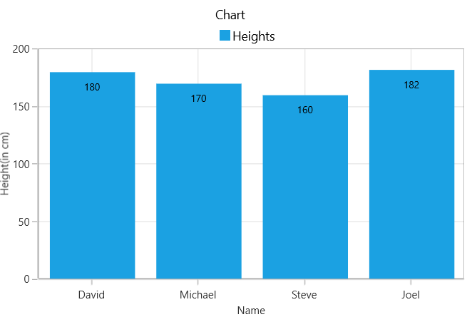

# GettingStartedChartWinUI
This is demo application of WinUI SfChart control. The minimal set of required properties have been configured in this project to get started with SfChart in WinUI.

## <a name="description"></a>Description ##

## Initialize chart
Add reference to [`Syncfusion.Chart.WinUI`](https://www.nuget.org/packages/Syncfusion.Chart.WinUI/) NuGet and import the control namespace `Syncfusion.UI.Xaml.Charts`  in XAML or C# to initialize the control.

###### Xaml
```xaml

<Page
    x:Class="SfChart_GettingStarted.MainPage"
    xmlns="http://schemas.microsoft.com/winfx/2006/xaml/presentation"
    xmlns:x="http://schemas.microsoft.com/winfx/2006/xaml"
    xmlns:local="using:SfChart_GettingStarted"
    xmlns:d="http://schemas.microsoft.com/expression/blend/2008"
    xmlns:syncfusion="using:Syncfusion.UI.Xaml.Charts"
    xmlns:mc="http://schemas.openxmlformats.org/markup-compatibility/2006"
    mc:Ignorable="d" Height="350" Width="525"
    Background="{ThemeResource ApplicationPageBackgroundThemeBrush}">  
    <Grid>
        <syncfusion:SfChart />            
    </Grid>
</Page>
 ```
###### C#
```C#

using Syncfusion.UI.Xaml.Charts;

namespace SfChart_GettingStarted
{
    public sealed partial class MainPage : Page
    {
        public MainPage()
        {
            InitializeComponent();
            
            SfChart chart = new SfChart();      
            Root_Chart.Children.Add(chart);
        }
    }   
}
```

## Initialize chart axis
`Chart`supports default axes, so that these axes ([`PrimaryAxis`](https://help.syncfusion.com/cr/winui/Syncfusion.UI.Xaml.Charts.SfChart.html#Syncfusion_UI_Xaml_Charts_SfChart_PrimaryAxis) and [`SecondaryAxis`](https://help.syncfusion.com/cr/winui/Syncfusion.UI.Xaml.Charts.SfChart.html#Syncfusion_UI_Xaml_Charts_SfChart_SecondaryAxis)) will get generated automatically based upon the data bind to the chart.

Axes will be explicitly specified for it's customization purpose. The initialization of an empty chart with two axes as shown below,

###### Xaml
```xaml
<syncfusion:SfChart> 
      <syncfusion:SfChart.PrimaryAxis> 
           <syncfusion:CategoryAxis /> 
      </syncfusion:SfChart.PrimaryAxis> 
      <syncfusion:SfChart.SecondaryAxis> 
           <syncfusion:NumericalAxis/> 
      </syncfusion:SfChart.SecondaryAxis>
</syncfusion:SfChart>
```
###### C#
```C#

SfChart chart = new SfChart();
CategoryAxis primaryAxis = new CategoryAxis();
chart.PrimaryAxis = primaryAxis;    
NumericalAxis secondaryAxis = new NumericalAxis();
chart.SecondaryAxis = secondaryAxis;
```

## Initialize view model

Now, let us define a simple data model that represents a data point in chart.

###### C#
```C#

public class Person   
{   
    public string Name { get; set; }

    public double Height { get; set; }
}
```

Next, create a view model class and initialize a list of `Person` objects as follows.

###### C#
```C#
public class ViewModel  
{
      public List<Person> Data { get; set; }      

      public ViewModel()       
      {
            Data = new List<Person>()
            {
                new Person { Name = "David", Height = 180 },
                new Person { Name = "Michael", Height = 170 },
                new Person { Name = "Steve", Height = 160 },
                new Person { Name = "Joel", Height = 182 }
            }; 
       }
 }
 ```

Set the `ViewModel` instance as the `DataContext` of your window; this is done to bind properties of `ViewModel` to  the chart.
 
N> Add namespace of `ViewModel` class to your XAML Page if you prefer to set `DataContext` in XAML.

###### Xaml
```xaml
<Page
    x:Class="SfChart_GettingStarted.MainPage"
    xmlns="http://schemas.microsoft.com/winfx/2006/xaml/presentation"
    xmlns:x="http://schemas.microsoft.com/winfx/2006/xaml"
    xmlns:local="using:SfChart_GettingStarted"
    xmlns:d="http://schemas.microsoft.com/expression/blend/2008"
    xmlns:syncfusion="using:Syncfusion.UI.Xaml.Charts"
    xmlns:mc="http://schemas.openxmlformats.org/markup-compatibility/2006"
    mc:Ignorable="d" Height="350" Width="525"
    Background="{ThemeResource ApplicationPageBackgroundThemeBrush}">

    <Page.DataContext>
        <local:ViewModel></local:ViewModel>
    </Page.DataContext>
</Page>
```
###### C#
```C#
this.DataContext = new ViewModel();
```

## Populate chart with data

As we are going to visualize the comparison of heights in the data model, add [`ColumnSeries`](https://help.syncfusion.com/cr/winui/Syncfusion.UI.Xaml.Charts.ColumnSeries.html) to [`Series`](https://help.syncfusion.com/cr/winui/Syncfusion.UI.Xaml.Charts.SfChart.html#Syncfusion_UI_Xaml_Charts_SfChart_Series) property of chart, and then bind the `Data` property of the above `ViewModel` to the `ColumnSeries.ItemsSource` as follows.

N> You need to set [`XBindingPath`](https://help.syncfusion.com/cr/winui/Syncfusion.UI.Xaml.Charts.ChartSeriesBase.html#Syncfusion_UI_Xaml_Charts_ChartSeriesBase_XBindingPath) and [`YBindingPath`](https://help.syncfusion.com/cr/winui/Syncfusion.UI.Xaml.Charts.XyDataSeries.html#Syncfusion_UI_Xaml_Charts_XyDataSeries_YBindingPath) properties, so that chart would fetch values from the respective properties in the data model to plot the series.

###### Xaml
```xaml
<syncfusion:SfChart>
    <syncfusion:SfChart.PrimaryAxis>
        <syncfusion:CategoryAxis Header="Name" />
    </syncfusion:SfChart.PrimaryAxis>
    <syncfusion:SfChart.SecondaryAxis>
        <syncfusion:NumericalAxis Header="Height(in cm)"/>
    </syncfusion:SfChart.SecondaryAxis>    
    <syncfusion:ColumnSeries  ItemsSource="{Binding Data}"
                              XBindingPath="Name"
                              YBindingPath="Height">
    </syncfusion:ColumnSeries>

 </syncfusion:SfChart> 
```

###### C#
```C#
SfChart chart = new SfChart();

//Adding horizontal axis to the chart 
CategoryAxis primaryAxis = new CategoryAxis();
primaryAxis.Header = "Name";   
chart.PrimaryAxis = primaryAxis;

//Adding vertical axis to the chart 
NumericalAxis secondaryAxis = new NumericalAxis();
secondaryAxis.Header = "Height(in cm)";  
chart.SecondaryAxis = secondaryAxis;

//Initialize the two series for SfChart
ColumnSeries series = new ColumnSeries();

series.ItemsSource = (new ViewModel()).Data;
series.XBindingPath = "Name";            
series.YBindingPath = "Height";         
            
//Adding Series to the Chart Series Collection
chart.Series.Add(series);
```
## Add title

The header of the chart acts as the title to provide quick information to the user about the data being plotted in the chart. You can set title using the `Header` property of chart as follows.

###### Xaml
```xaml
<Grid>
   <syncfusion:SfChart Header="Chart"> 
   </syncfusion:SfChart> 
</Grid>
```
###### C#
```C#
chart.Header = "Chart";
```

## Enable data markers

You can add data labels to improve the readability of the chart and it can be enabled using [`DataMarker`](https://help.syncfusion.com/cr/winui/Syncfusion.UI.Xaml.Charts.DataMarkerSeries.html#Syncfusion_UI_Xaml_Charts_DataMarkerSeries_DataMarker) property of [`ChartSeries`](https://help.syncfusion.com/cr/winui/Syncfusion.UI.Xaml.Charts.DataMarkerSeries.html). By default, there is no label displayed, you have to set [`ShowLabel`](https://help.syncfusion.com/cr/winui/Syncfusion.UI.Xaml.Charts.ChartDataMarkerBase.html#Syncfusion_UI_Xaml_Charts_ChartDataMarkerBase_ShowLabel) property of [`ChartDataMarker`](https://help.syncfusion.com/cr/winui/Syncfusion.UI.Xaml.Charts.ChartDataMarker.html) to True.

###### Xaml
```xaml
<syncfusion:SfChart>
	...
  <syncfusion:ColumnSeries > 
        <syncfusion:ColumnSeries.DataMarker>
            <syncfusion:ChartDataMarker LabelPosition="Inner" ShowLabel="True" />
        </syncfusion:ColumnSeries.DataMarker>
  </syncfusion:ColumnSeries>  
	...
</syncfusion:SfChart>
```
###### C#
```C#
series.DataMarker = new ChartDataMarker (){ ShowLabel = true }; 
```

## Enable legend

You can enable legend using the [`SfChart.Legend`](https://help.syncfusion.com/cr/winui/Syncfusion.UI.Xaml.Charts.ChartBase.html#Syncfusion_UI_Xaml_Charts_ChartBase_Legend) property as follows.

###### Xaml
```xaml
<syncfusion:SfChart>
	...
    <syncfusion:SfChart.Legend>
        <syncfusion:ChartLegend/>
    </syncfusion:SfChart.Legend>
    ...
</syncfusion:SfChart>
```
###### C#
```C#
chart.Legend = new ChartLegend (); 
```

Additionally, you need to set label for each series using the [`Label`](https://help.syncfusion.com/cr/winui/Syncfusion.UI.Xaml.Charts.ChartSeriesBase.html#Syncfusion_UI_Xaml_Charts_ChartSeriesBase_Label) property of ChartSeries, which will be displayed in corresponding legend.

###### Xaml
```xaml
<syncfusion:SfChart>
	...
      <syncfusion:ColumnSeries Label="Heights" ItemsSource="{Binding Data}" XBindingPath="Name" YBindingPath="Height" />
	...
</syncfusion:SfChart>
```
###### C#
```C#
ColumnSeries series = new ColumnSeries (); 
series.ItemsSource = (new ViewModel()).Data;
series.XBindingPath = "Name"; 
series.YBindingPath = "Height"; 
series.Label = "Heights";
```
## Enable tooltip

Tooltips are used to show information about the segment, when you click the segment. You can enable tooltip by setting series [`ShowTooltip`](https://help.syncfusion.com/cr/winui/Syncfusion.UI.Xaml.Charts.ChartSeriesBase.html#Syncfusion_UI_Xaml_Charts_ChartSeriesBase_ShowTooltip) property to true.

###### Xaml
```xaml
<syncfusion:SfChart>
	...
   <syncfusion:ColumnSeries ShowTooltip="True" ItemsSource="{Binding Data}" XBindingPath="Name" YBindingPath="Height"/>
	...
</syncfusion:SfChart> 
```
###### C#
```C#
ColumnSeries series = new ColumnSeries();
series.ItemsSource = (new ViewModel()).Data;
series.XBindingPath = "Name";          
series.YBindingPath = "Height";
series.ShowTooltip = true;
```
The following code example gives you the complete code of above configurations.

###### Xaml
```xaml
<Page
    x:Class="SfChart_GettingStarted.MainPage"
    xmlns="http://schemas.microsoft.com/winfx/2006/xaml/presentation"
    xmlns:x="http://schemas.microsoft.com/winfx/2006/xaml"
    xmlns:local="using:SfChart_GettingStarted"
    xmlns:d="http://schemas.microsoft.com/expression/blend/2008"
    xmlns:syncfusion="using:Syncfusion.UI.Xaml.Charts"
    xmlns:mc="http://schemas.openxmlformats.org/markup-compatibility/2006"
    mc:Ignorable="d" Height="350" Width="525"
    Background="{ThemeResource ApplicationPageBackgroundThemeBrush}">
    <!--Setting DataContext-->
    <Page.DataContext>
        <local:ViewModel></local:ViewModel>
    </Page.DataContext>

    <Grid>
        <syncfusion:SfChart Header="Chart">
            <!--Initialize the horizontal axis for SfChart-->
            <syncfusion:SfChart.PrimaryAxis>
                <syncfusion:CategoryAxis Header="Name" />
            </syncfusion:SfChart.PrimaryAxis>
            <syncfusion:SfChart.SecondaryAxis>
                <syncfusion:NumericalAxis Header="Height(in cm)"/>
            </syncfusion:SfChart.SecondaryAxis>

            <!--Adding Legend to the SfChart-->
            <syncfusion:SfChart.Legend>
                <syncfusion:ChartLegend />
            </syncfusion:SfChart.Legend>

            <!--Initialize the series for SfChart-->
            <syncfusion:ColumnSeries  ItemsSource="{Binding Data}"
                                      XBindingPath="Name"
                                      YBindingPath="Height"
                                      Label="Heights"
                                      ShowTooltip="True">
                   <!--Add data marker to the series-->                
                    <syncfusion:ColumnSeries.DataMarker>
                        <syncfusion:ChartDataMarker LabelPosition="Inner" ShowLabel="True" />
                    </syncfusion:ColumnSeries.DataMarker>               
            </syncfusion:ColumnSeries>          

        </syncfusion:SfChart>
    </Grid>
</Page>
``` 
###### C#
```C#
using Syncfusion.UI.Xaml.Charts;

namespace SfChart_GettingStarted
{
    public sealed partial class MainPage : Page
    {
        public MainPage()
        {
            InitializeComponent();
            
            SfChart chart = new SfChart() { Header = "Chart", Height = 300, Width = 500 };

            //Adding horizontal axis to the chart 
            CategoryAxis primaryAxis = new CategoryAxis();
            primaryAxis.Header = "Name";
            primaryAxis.FontSize = 14;
            chart.PrimaryAxis = primaryAxis;

            //Adding vertical axis to the chart 
            NumericalAxis secondaryAxis = new NumericalAxis();
            secondaryAxis.Header = "Height(in cm)";
            secondaryAxis.FontSize = 14;
            chart.SecondaryAxis = secondaryAxis;

            //Adding Legends for the chart
            ChartLegend legend = new ChartLegend();
            chart.Legend = legend;

            //Initializing column series
            ColumnSeries series = new ColumnSeries();
            series.ItemsSource = (new ViewModel()).Data;
            series.XBindingPath = "Name";            
            series.YBindingPath = "Height";
            series.ShowTooltip = true;
            series.Label = "Heights";      

            //Setting data marker to the chart series
            series.DataMarker = new ChartDataMarker() { ShowLabel = true };

            //Adding Series to the Chart Series Collection
            chart.Series.Add(series);
            Root_Chart.Children.Add(chart);    
        }
    }   
}
```

## <a name="output"></a>Output ##


